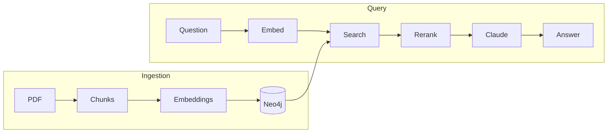

# Corpus

RAG system that turns your notes (PDFs) into a queryable knowledge graph.

## Quick Start

1. Add your API keys to `.env`:
```bash
cp .env.example .env
# Edit with your Anthropic, OpenAI, and Cohere keys
```

2. Start services:
```bash
docker-compose up -d
```

3. Verify it's running:
```bash
curl http://localhost:8000/health
```

## Usage

### Ingest PDFs

Put PDFs in `data/raw/`, then:

```bash
curl -X POST http://localhost:8000/ingest \
  -H "Content-Type: application/json" \
  -d '{"file_paths": ["/data/raw/your_notes.pdf"]}'
```

### Ask Questions

```bash
curl -X POST http://localhost:8000/query \
  -H "Content-Type: application/json" \
  -d '{"question": "Explain dynamic programming"}'
```

### Explore the Graph

```bash
curl http://localhost:8000/graph/dynamic%20programming?depth=2
```

### API Docs

http://localhost:8000/docs

## Architecture



**Stack**: FastAPI, Neo4j, Redis, OpenAI embeddings, Cohere reranking, Claude

## Local Dev

```bash
cd backend
uv sync                           # creates .venv
uv run pytest                     # run tests
docker-compose up -d              # run services
```